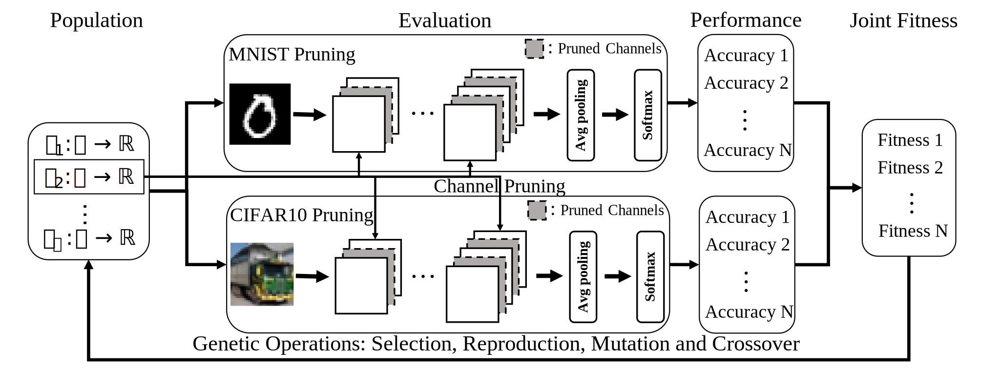

## Overview

<a></a>

Above image shows the genetic programming framework for our evolution. 
A population of functions is applied to conduct pruning tasks on two datasets, MNIST and CIFAR-10. 
Each function receives a fitness value by combining its pruned networks’
accuracies on both tasks. 
The population will then go through a natural selection process to enhance the functions’ effectiveness.

## Usage

To start an evolution can be done by: 
```
python3 Co_Evolution_Parallel.py
```

Note the code is implemented on a [SLURM](https://slurm.schedmd.com/documentation.html) job server (Princeton TigerGPU) for generation-level parallelism. 
The hyper-parameters for overall evolution process is specified by [Co_Evolution_Hyperparams.py](./Co_Evolution_Hyperparams.py) 
and the hyper-parameters for pruning evaluations are included in  [LeNet5_Eval_Hyperparams.py](./LeNet5_Eval_Hyperparams.py) and [VGG16_Eval_Hyperparams.py](./VGG16_Eval_Hyperparams.py).

