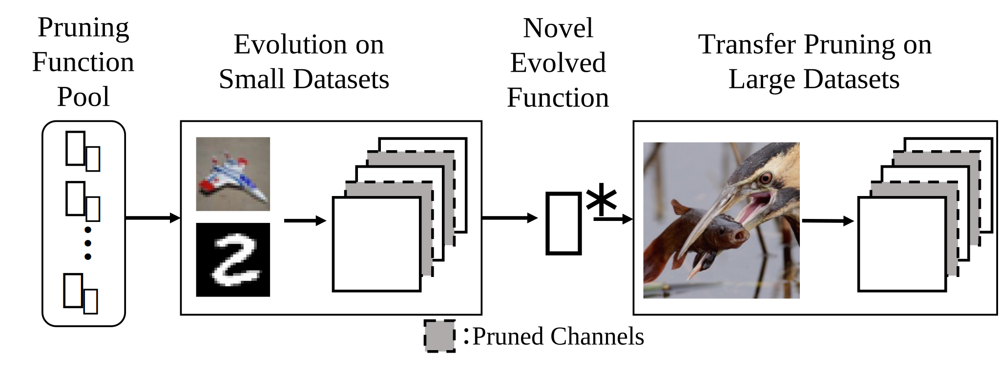

# Evolving Transferable Neural Pruning Functions [[Paper]](https://dl.acm.org/doi/10.1145/3512290.3528694) [[ArXiv]](https://arxiv.org/abs/2110.10876)

## Paper in GECCO2022
```BibTex
@inproceedings{liu2022evolving,
  title     = {Evolving transferable neural pruning functions},
  author    = {Liu, Yuchen and Kung, Sun-Yuan and Wentzlaff, David},
  booktitle = {Proceedings of the Genetic and Evolutionary Computation Conference},
  pages     = {385--394},
  year      = {2022}
}
```

This repository contains the codes for *Evolving Transferable Neural Pruning Functions*, which is published in GECCO.

## Overview

<a></a>


We propose to learn transferable channel pruning functions via an evolution strategy, genetic programming. The evolved functions show generalizability when applied to datasets and networks different from that in evolution. 

